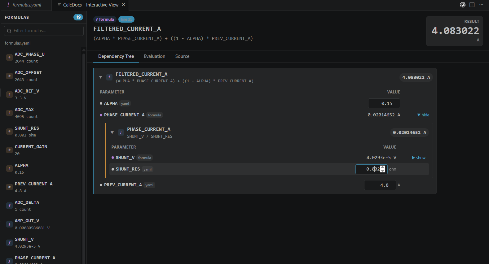
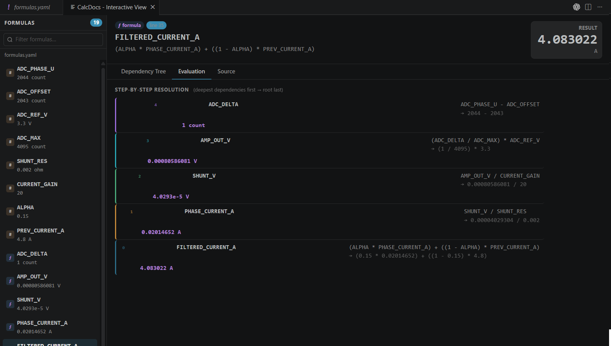

# Interactive Formula Viewer

CalcDocs provides an **interactive webview panel** that lets you explore formulas, tweak inputs, and see results **in real time** — without editing source files.

The viewer opens automatically when you open a file with calculable content and click the **CalcDocs: Interactive View** button, or run the `CalcDocs: Open Interactive View` command.

> **Note**: The Interactive Formula Viewer was introduced is currently available for `formula*.yaml` files and **C/C++ files with inline calculations**.

---

## Supported File Types

| File Type | Behavior |
|-----------|----------|
| ✅ `formula*.yaml` | Parses all named formulas from the YAML file. Dependencies between formulas are resolved automatically. You can edit any constant value and see the cascade effect on all dependent formulas. |
| ✅ **C/C++ with inline calcs** (`// @var = ...`) | Extracts all inline variable assignments from comments. Other indexed symbols (`#define`, YAML entries) are also available as interactive inputs. |
| ❌ Plain C/C++ without inline calcs | The viewer will show indexed formulas from the workspace if available, or remain empty. |

---

## What It Looks Like





The panel is divided into:

1. **Formula list** (left sidebar) — all available formulas in the current file
2. **Detail area** (main panel) — shows the selected formula with:
   - **Original expression** and YAML block (if applicable)
   - **Direct parameters**: constant inputs that you can edit
   - **Formula-derived parameters**: read-only values computed from other formulas
   - **Root result**: final computed value with unit

---

## How It Works

### For `formula*.yaml` files

When you open a `formula*.yaml` file (e.g., `formulas.yaml`, `formulas-power.yaml`), the viewer:

1. Parses every named formula entry using the same parser that powers ghost values and CodeLens
2. Builds a dependency graph: if `power` depends on `vin` and `current`, those dependencies are linked automatically
3. Shows the **YAML block** as-is in the detail panel
4. Lets you **edit** any constant parameter (e.g., change `vin` from `24` to `48`), and:
   - All dependent formulas are recomputed instantly
   - The root result updates in real time
   - Intermediate formula results also update
5. Flags **invalid inputs**, **cycles**, and **depth-limit violations** with clear visual indicators

### For C/C++ files with inline calculations

When you open a C/C++ file that contains inline variable assignments:

```c
// @vin = 24 V
// @current = 2 A
// @power = @vin * @current
// @efficiency = 0.85
// @power_out = @power * @efficiency -> W
```

The viewer:

1. Extracts each `@name = value` assignment as an interactive parameter
2. Also includes all workspace-indexed symbols (`#define` macros, YAML formulas) as read-only formula inputs
3. Lets you **edit** any inline-defined value directly in the webview — for example, change `@vin` from `24` to `12`, and `@power`, `@power_out` update immediately
4. Supports **unit conversion** via `-> unit` syntax: the viewer displays the converted value
5. Preserves the original source line information for traceability

> **Inline-only expressions** (`// = 25% * 200W -> W` without a `@name =` assignment) are treated as documentation and not shown in the viewer — they are not interactive parameters.

---

## Features

### ✏️ Editable Constants

Any direct constant value (number, or number + unit) can be edited in-place. The viewer provides a numeric input field for each editable parameter.

### 🔗 Dependency Cascading

When you change a value that other formulas depend on, all affected results are recomputed automatically:

```
vin (24) ──┐
           ├── power (48) ──┐
current (2) ┘               ├── power_loss (7.2)
                   efficiency (0.85) ┘
```

Changing `vin` → `12` cascades: `power` → `24`, `power_loss` → `3.6`.

### 🔍 Visual States

Each parameter and result has a clear visual state:

| State | Meaning |
|-------|---------|
| ✅ Normal | Value computed successfully |
| ✏️ Overridden | User changed the value from its original |
| ⚠️ Warning | Computation succeeded but with a warning |
| ❌ Error | Invalid expression or unit mismatch |
| 🔄 Cycle | Circular dependency detected |
| ⬇️ Depth-limited | Nesting exceeded maximum expansion depth (5 levels) |

### 📋 Nested Formula Tree

For formula-derived parameters (e.g., a YAML formula that depends on another YAML formula), the viewer shows a collapsible tree with the full resolution chain.

### 🧪 Realtime Evaluation Mode

Every input change immediately posts an event to the extension engine, which recomputes the entire dependency graph. Results stream back to the viewer without any manual refresh.

---

## Comparison: Inline Calculations vs Interactive Viewer

| Aspect | Inline Ghost Values / Hover | Interactive Viewer |
|--------|---------------------------|-------------------|
| **Purpose** | Quick read-only preview | Deep exploration & editing |
| **Editing** | ❌ No | ✅ Edit any constant |
| **Dependency graph** | ❌ Linear | ✅ Full tree |
| **Cascade recompute** | ❌ No | ✅ Yes |
| **Unit conversion** | ✅ Yes | ✅ Yes |
| **Multiple files** | Current file only | Workspace symbols also available |

---

## Related Settings

The Interactive Formula Viewer respects the same settings as the rest of CalcDocs:

- Unit evaluation and conversion follow `calcdocs.unit.*` settings
- Diagnostic levels for inline calculations (`calcdocs.inline.diagnostics.level`) affect error/warning display in the viewer

---

## See Also

- [Inline Calculations](inline-calculations.md) — full syntax reference for inline `@var` assignments
- [Formula YAML Guide](formulas-yaml.md) — how to define formulas in YAML
- [Nested Interactive Evaluator](nested-interactive-evaluator.md) — technical details on the evaluation engine