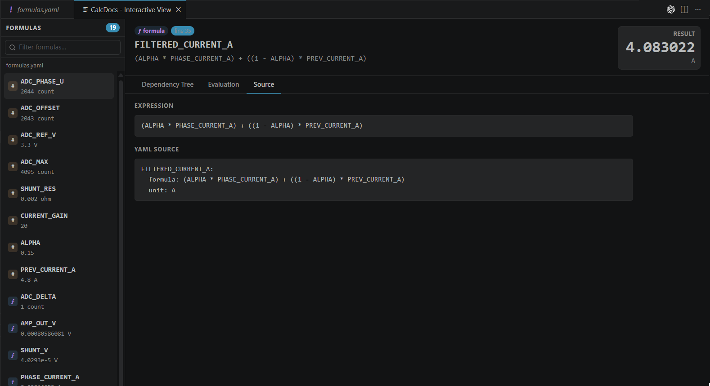

# Interactive Formula Viewer

CalcDocs includes a fully interactive **Formula Viewer** that lets you inspect formulas, explore dependency chains, edit inputs, and recompute results in real time — directly inside VS Code.

The viewer is designed for both:

- `formula*.yaml` workflows
- C/C++ source files containing inline calculations

It provides a live, navigable evaluation environment for engineering formulas without modifying source code.

> Supported for:
> - `formula*.yaml`
> - C/C++ files with inline calculations (`// @var = ...`)

---

# Opening the Viewer

The Interactive Formula Viewer opens when:

- you click **CalcDocs: Interactive View**
- or run the command:

```text
CalcDocs: Open Interactive View
```

When supported calculable content is detected, the webview automatically indexes formulas and builds a live evaluation graph.

---

# Supported File Types

| File Type | Behavior |
|---|---|
| ✅ `formula*.yaml` | Parses named formulas and resolves dependencies automatically |
| ✅ C/C++ with inline calculations | Extracts `// @var = ...` expressions as interactive formulas |
| ❌ Unsupported text files | No formulas available |

---

# Viewer Overview


The viewer is organized into two main areas:

## Formula Sidebar

The left panel contains:

- all detected formulas
- constants
- inline variables
- indexed workspace symbols

Each entry shows:

- current evaluated value
- unit
- symbol type (`formula`, `yaml`, `inline`, etc.)

---

## Formula Detail Panel

Selecting a formula opens a detailed interactive view.

The panel includes:

- evaluated result
- expression preview
- dependency tree
- editable parameters
- original source definition
- live recomputation state

---

# Tabs

## Dependency Tree

The **Dependency Tree** provides a full expandable evaluation graph.


Features include:

- nested dependency expansion
- inline editing of constants
- realtime cascade recomputation
- per-node units and values
- source origin badges
- collapsible formula chains

This makes it easy to trace how a final result was produced.

Example:

```text
FILTERED_CURRENT_A
 ├── ALPHA
 ├── PHASE_CURRENT_A
 │    ├── SHUNT_V
 │    └── SHUNT_RES
 └── PREV_CURRENT_A
```

Changing `SHUNT_RES` immediately propagates through:

```text
SHUNT_RES
 → PHASE_CURRENT_A
 → FILTERED_CURRENT_A
```

without reloading the file.

---

## Evaluation

The **Evaluation** tab focuses on computed values and diagnostics.

It shows:

- resolved numerical values
- converted units
- warnings
- dimensional-analysis issues
- runtime evaluation errors

This tab is optimized for quick validation and debugging.

---

## Source

The **Source** tab displays the original formula definition alongside the parsed expression.



Depending on the source type, this may include:

- YAML blocks
- inline calculation definitions
- source line references
- normalized expressions

This is useful for traceability and debugging complex formula systems.

---

# YAML Formula Support

For `formula*.yaml` files, CalcDocs:

1. Parses all named formulas
2. Builds a dependency graph
3. Resolves nested formulas automatically
4. Preserves original YAML source
5. Enables live editing of constants

Example:

```yaml
POWER_OUT:
  formula: VIN * CURRENT * EFFICIENCY
  unit: W
```

When editing:

```text
VIN: 24 → 48
```

all dependent formulas update instantly.

---

# C/C++ Inline Formula Support

CalcDocs also supports inline engineering calculations directly inside C/C++ comments.

Example:

```c
// @vin = 24 V
// @current = 2 A
// @power = @vin * @current
// @efficiency = 0.85
// @power_out = @power * @efficiency -> W
```

The viewer extracts these definitions and turns them into interactive formulas.

Supported features include:

- editable inline constants
- nested formula references
- unit conversion
- dependency tracking
- workspace symbol integration
- source line mapping

---

## Unit Conversion

Inline expressions can specify output units:

```c
// @power_out = @power * @efficiency -> W
```

The viewer automatically converts and displays the evaluated result using the requested unit.

---

## Non-interactive Inline Expressions

Expressions without named assignments are treated as documentation only.

Example:

```c
// = 25% * 200W -> W
```

These are evaluated for hover/ghost rendering but are not added to the interactive graph.

---

# Live Editing & Realtime Recompute

Editable constants appear directly inside the dependency tree.

When a value changes:

1. the webview sends an update event
2. CalcDocs recomputes the dependency graph
3. updated results stream back instantly
4. affected formulas refresh automatically

No manual refresh is required.

---

# Visual States

The viewer exposes formula states visually to simplify debugging.

| State | Meaning |
|---|---|
| ✅ Normal | Formula evaluated successfully |
| ✏️ Overridden | User modified original value |
| ⚠️ Warning | Evaluation succeeded with warnings |
| ❌ Error | Invalid expression or unit mismatch |
| 🔄 Cycle | Circular dependency detected |
| ⬇️ Depth Limited | Maximum nesting depth exceeded |

---

# Dependency Expansion

Formula-derived parameters can be expanded recursively.

This allows full inspection of:

- intermediate formulas
- nested conversions
- chained dependencies
- inherited parameters

The viewer currently limits recursive expansion depth to avoid infinite evaluation loops.

---

# Comparison with Inline Ghost Values

| Feature | Ghost Values / Hover | Interactive Viewer |
|---|---|---|
| Quick preview | ✅ | ✅ |
| Editable constants | ❌ | ✅ |
| Dependency graph | ❌ | ✅ |
| Realtime recompute | ❌ | ✅ |
| Nested expansion | ❌ | ✅ |
| Unit conversion | ✅ | ✅ |
| Workspace symbol integration | Limited | ✅ |

---

# Shared Settings

The Interactive Formula Viewer respects the same settings used by the rest of CalcDocs.

Examples include:

```json
calcdocs.unit.*
calcdocs.inline.diagnostics.level
```

These settings affect:

- unit conversion
- diagnostics visibility
- warning behavior
- dimensional analysis
- evaluation formatting
